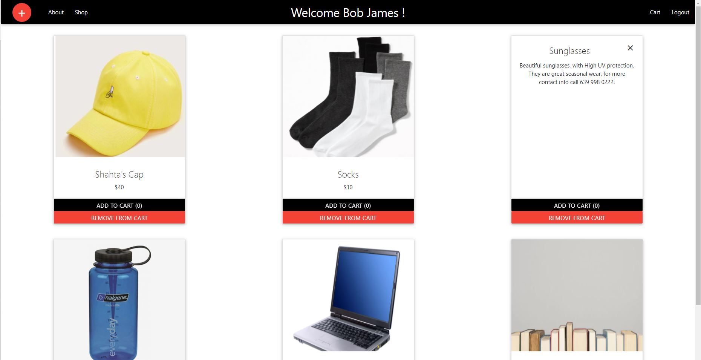
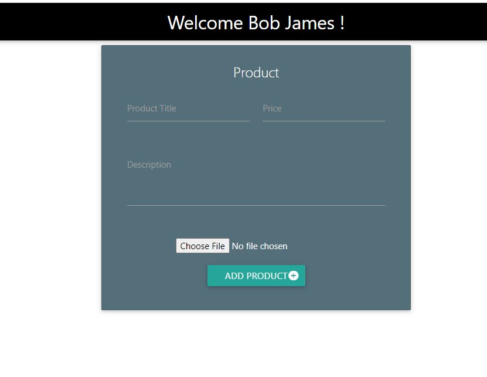

https://crowd-buy.netlify.app/

The registration page ensures the user puts an email in the email field, and that the password is atleast 6 characters long. 
The email is then checked to ensure there isnt a pre-existing email in the database. 
The password further is hashed by using the Hash key that is stored in an environment variable that is not uploaded on GIT-HUB.
It is also required to have all the fields filled out before pressing submit or an error will occur.
After registrating, there will be a confirmation message and the page will be redirected the use to the login page.  
 

The login page is a component in React creates a call to the backend, (NodeJS) to ensure the email is exists.
Once that is confirmed it unhashes the password from the database and checks if it is the same as the one entered.
If it is not then it will indicate that the password is not correct or the email does not exist accordingly. 
- It also creates a JWT Token to esnure the use is logged in unless they click log out
- The token is stored on the local storage and when the log out button is pressed the storage is cleared
 

Once logged in, it gives a message that the user is logged in. It further directs the user to the Shop page and 
changes the Nav Bar to have options that only display when a user is logged in. It gives an array of items posted by different 
people. You can also add your own items to the array for the public to buy. 
 

The plus button is used to add items to the array, it uses materialize template to make the button an 'add icon'. 
 

All fields are required along with a photo for the item to be posted. 
There must be a description with information for contact information 
and product specificiations. 
 

The user can delete thier own products/items. 
 

